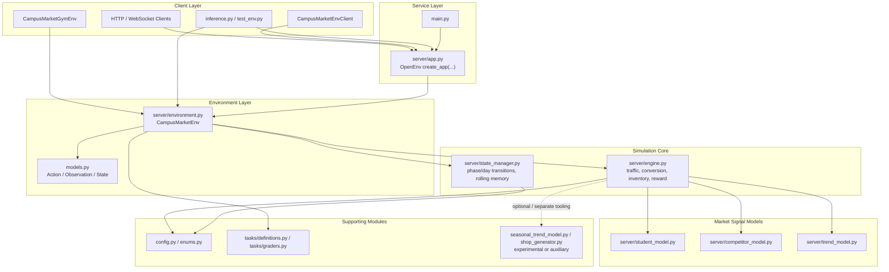
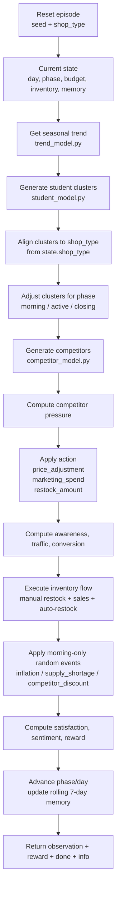

# CampusMarket RL — OpenEnv + Gymnasium Campus Shop Simulation

[]()
[]()
[]()
[]()
[]()
[]()

> Run a campus shop through demand swings, competitor pressure, budget limits, and seasonal shifts. Tune price, marketing, and inventory while trying to keep both profit and satisfaction healthy.

## Project Overview

CampusMarket RL is a deterministic reinforcement learning environment for simulating a small shop on a university campus. The agent manages day-to-day retail decisions while the environment models student demand, seasonality, competition, budget usage, inventory flow, and customer satisfaction.

The project exposes the same core simulation in multiple ways:

- an OpenEnv-compatible FastAPI server
- a direct Python environment class
- a Gymnasium wrapper for fixed-size vector observations
- example inference and smoke-test scripts

Key features:

- 90-day environment with `morning`, `active`, and `closing` phases
- seeded, reproducible transitions for evaluation
- student demand clusters with different budgets and price sensitivity
- deterministic competitor generation and normalized competitor pressure
- seasonal trends: `normal`, `festival`, `exam`, and `holiday`
- random morning events such as inflation and supply shortages
- benchmark task definitions and grading helpers

Important update from older versions:

- The step action space currently has **3 fields**: `price_adjustment`, `marketing_spend`, and `restock_amount`
- Shop selection is now handled through `reset(..., shop_type="...")`, not as a per-step `product_focus` field

---

## TL;DR

- OpenEnv-compatible server with `/reset`, `/step`, `/state`, `/schema`, and `/ws`
- Gymnasium wrapper with an 11-feature observation vector
- Deterministic environment under a fixed seed
- Core simulation includes demand, competition, seasonality, inventory, and reward shaping
- Example scripts included for local testing, inference, seasonal experiments, and shop generation

---

## Table of Contents

- [Quick Start](#quick-start)
- [Architecture](#architecture)
- [Environment Description](#environment-description)
- [Action Space](#action-space)
- [Observation Space](#observation-space)
- [Reward Function](#reward-function)
- [Dynamics](#dynamics)
- [Benchmark Tasks](#benchmark-tasks)
- [Usage](#usage)
- [Project Structure](#project-structure)
- [Configuration](#configuration)
- [Additional Notes](#additional-notes)

---

## Quick Start

### Prerequisites

- Python 3.10+
- `pip`
- Optional: Docker
- Optional: API credentials if you want to run the LLM-driven scripts

### Installation

```bash
git clone https://github.com/Mrigank923/campusMarketRL.git
cd campusMarketRL
```

Create a virtual environment:

```bash
python -m venv .venv
source .venv/bin/activate
```

Windows PowerShell:

```powershell
python -m venv .venv
.venv\Scripts\Activate.ps1
```

Install dependencies:

```bash
pip install -r requirements.txt
pip install -e .
```

Optional Gymnasium support:

```bash
pip install -e ".[gym]"
```

Optional environment file:

```bash
cp .env.example .env
```

Start the server:

```bash
python main.py
```

Open:

- `http://localhost:7860/docs`

---

## Architecture

The project is organized as a layered environment stack: clients talk to an OpenEnv-compatible FastAPI server, which wraps the core environment class, which delegates simulation logic to the pure engine and transition helpers.



### Runtime Flow

The main server path is:

```text
Client -> OpenEnv/FastAPI app -> CampusMarketEnv.reset()/step()
       -> engine.compute_step() + state_manager.transition_after_step()
       -> structured observation + reward + info
```

### Step Computation Flow

The older README described a four-control loop. In the current code, the step action has three controls, and shop focus comes from the episode-level `shop_type` chosen during `reset(...)`.



### Component Responsibilities

- `server/app.py`: exposes the environment through OpenEnv/FastAPI endpoints
- `server/environment.py`: owns session state, reset/step orchestration, and metadata
- `server/engine.py`: computes the actual market dynamics and reward
- `server/state_manager.py`: advances phase/day and maintains 7-day rolling memory
- `models.py`: defines strict Pydantic schemas for actions, observations, and state
- `gym_env.py`: adapts structured observations to a fixed Gymnasium vector
- `client.py`: provides an OpenEnv client wrapper for remote interaction

---

## Environment Description

The environment simulates a campus retail shop over a maximum of **90 days**, with **3 phases per day**:

- `morning`
- `active`
- `closing`

This yields a maximum episode length of **270 steps**.

At a high level, each step works like this:

1. The environment reads the current day, phase, budget, inventory, awareness, and rolling memory.
2. A seasonal trend is chosen deterministically for the current day.
3. Student clusters are generated with different sizes, budgets, category preferences, and price sensitivity.
4. Competitor shops are generated and collapsed into a normalized `competitor_pressure` score.
5. The agent action is applied:
   - `price_adjustment` changes effective selling price and conversion
   - `marketing_spend` increases awareness but consumes budget
   - `restock_amount` buys more units if budget and capacity allow
6. Demand is converted into traffic, sales, revenue, inventory movement, and satisfaction updates.
7. A morning-only random event may apply:
   - `inflation`
   - `supply_shortage`
   - `competitor_discount`
8. Reward is computed from profit, satisfaction, inventory balance, pricing behavior, and budget health.
9. The phase advances, and after each `closing` step the last-7-days memory is updated.

### Shop Types

The environment supports these shop types:

- `cafe`
- `food`
- `tech`
- `stationary`

The selected `shop_type` is stored in environment state and affects demand alignment and competitor matching. It is set when resetting the environment:

```python
obs = env.reset(seed=42, shop_type="food")
```

### State Behavior

The environment tracks both immediate metrics and rolling business context:

- current day and phase
- total step count
- monthly budget
- inventory level
- awareness
- rolling last 7 days of revenue
- rolling last 7 days of satisfaction

The monthly budget resets every 30 in-simulation days.

---

## Action Space

The step action is defined by `CampusMarketAction` in `models.py`.

### Raw Environment Action

```json
{
  "price_adjustment": 0.1,
  "marketing_spend": 250.0,
  "restock_amount": 40
}
```

| Field | Type | Space | Range | Description |
| --- | --- | --- | --- | --- |
| `price_adjustment` | `float` | Continuous | `[-1.0, 1.0]` | Relative price movement. Positive raises price, negative discounts. |
| `marketing_spend` | `float` | Continuous | `[0, +inf)` | Marketing budget requested for the current step. |
| `restock_amount` | `int` | Discrete count | `[0, +inf)` | Requested number of units to manually restock. |

Execution notes:

- Marketing spend is capped by remaining budget.
- Restocking is limited by both remaining budget and inventory capacity.
- Inventory capacity is `400` units.
- Manual and auto-restock cost `1.8` per unit.

### Gymnasium Action Space

`CampusMarketGymEnv` exposes a `spaces.Dict` action space:

- `price_adjustment`: `Box(low=-1.0, high=1.0, shape=(1,), dtype=float32)`
- `marketing_spend`: `Box(low=0.0, high=2000.0, shape=(1,), dtype=float32)`
- `restock_amount`: `Box(low=0, high=200, shape=(1,), dtype=int32)`

### Example Actions

Conservative:

```json
{
  "price_adjustment": 0.0,
  "marketing_spend": 100.0,
  "restock_amount": 10
}
```

Promotional push:

```json
{
  "price_adjustment": -0.15,
  "marketing_spend": 500.0,
  "restock_amount": 60
}
```

Margin-seeking move:

```json
{
  "price_adjustment": 0.08,
  "marketing_spend": 80.0,
  "restock_amount": 5
}
```

---

## Observation Space

The raw environment returns a `CampusMarketObservation`.

### Raw Observation Schema

| Field | Type | Meaning |
| --- | --- | --- |
| `day` | `int` | Current day in the episode, starting at 1 |
| `phase` | `str` | One of `morning`, `active`, `closing` |
| `shop_traffic` | `int` | Number of visitors for the current step |
| `conversion_rate` | `float` | Fraction of visitors who purchase |
| `revenue` | `float` | Revenue produced in the current step |
| `customer_satisfaction` | `float` | Satisfaction score in `[0, 1]` |
| `satisfaction` | `float` | Alias kept synchronized with `customer_satisfaction` |
| `inventory_level` | `float` | Normalized inventory fill in `[0, 1]` |
| `monthly_budget` | `float` | Remaining monthly budget |
| `awareness` | `float` | Shop awareness in `[0, 1]` |
| `market_sentiment` | `float` | Aggregate market signal in `[0, 1]` |
| `competitor_pressure` | `float` | Competitive pressure in `[0, 1]` |
| `trend_factor` | `float` | Seasonal demand multiplier |
| `reward` | `float` | Reward assigned to the transition |
| `done` | `bool` | Whether the episode is finished |
| `info` | `dict` | Transition/debug information |
| `metadata` | `dict` | Metadata such as seed, step, and day |

Typical `info` fields include:

- `executed_day`
- `executed_phase`
- `next_day`
- `next_phase`
- `trend`
- `quarter`
- `cluster_count`
- `price_sensitivity`
- `realized_sales`
- `lost_sales`
- `stockout_flag`
- `event`
- `executed_marketing_spend`
- `manual_restock_units`
- `auto_restock_units`
- `effective_base_price`
- `net_profit`

### Gymnasium Observation Space

The Gymnasium wrapper converts the structured observation into an 11-dimensional `float32` vector:

```text
[
  day,
  phase_index,
  shop_traffic,
  conversion_rate,
  revenue,
  customer_satisfaction,
  inventory_level,
  monthly_budget,
  awareness,
  market_sentiment,
  competitor_pressure
]
```

Phase mapping:

- `morning -> 0.0`
- `active -> 1.0`
- `closing -> 2.0`

Observation feature names are defined in `config.py` as `OBSERVATION_FEATURE_NAMES`.

---

## Reward Function

The reward is computed in `server/engine.py` and then clamped to `[-50.0, 50.0]`.

At a high level, the reward combines:

- net profit from revenue minus marketing and restocking costs
- satisfaction improvement over the previous step
- absolute satisfaction level relative to the default baseline
- inventory balance around the target level
- reward for moving inventory toward the target range
- penalties for overstocking
- penalties for controllable stockouts
- penalties for aggressive overpricing
- penalties when the remaining monthly budget gets too low

Core terms:

```text
reward =
  net_profit / 120
  + satisfaction_delta_term
  + satisfaction_level_term
  - inventory_balance_penalty
  - overstock_penalty
  + inventory_progress_reward
  - controllable_stockout_penalty
  - overpricing_penalty
  - budget_shortfall_penalty
```

Important constants from `config.py`:

- inventory target level: `0.45`
- inventory target tolerance: `0.15`
- overstock level: `0.8`
- controllable stockout penalty: `12.0`
- reward clamp: `[-50.0, 50.0]`

This makes the environment profit-oriented, but not profit-only. High prices, low inventory, or budget exhaustion can still reduce long-term reward.

---

## Dynamics

### Student Demand Model

Each day the engine generates deterministic student clusters using the seed, day, and current trend.

Cluster behavior includes:

- `3` to `6` clusters in normal conditions
- up to `4` clusters during holidays
- different budget bands, cluster sizes, and price sensitivity
- a preferred shop category from the supported shop types

Budget bands and sensitivity ranges:

- low-budget clusters: budget `70-120`, sensitivity roughly `0.65-0.95`
- mid-budget clusters: budget `121-220`, sensitivity roughly `0.35-0.70`
- high-budget clusters: budget `221-360`, sensitivity roughly `0.10-0.45`

### Competitor Model

The environment generates `4` competitor shops per step.

Each competitor has:

- `shop_type`
- `pricing_factor`
- `marketing_power`
- `inventory_level`

Competitor pressure is normalized into `[0, 1]`. Same-type competitors matter more than cross-category competitors.

### Seasonal Trends

The core environment uses `server/trend_model.py` with four trend types:

- `normal`
- `festival`
- `exam`
- `holiday`

Trend multipliers:

- `normal -> 1.0`
- `festival -> 1.3`
- `exam -> 0.7`
- `holiday -> 0.5`

### Random Events

Random events are checked only in the `morning` phase:

- inflation: probability `0.03`
- supply shortage: probability `0.03`
- competitor discount: probability `0.03`

Effects:

- inflation increases effective base price
- supply shortage reduces inventory
- competitor discount increases competitor pressure

---

## Benchmark Tasks

The repository currently includes:

- task definitions in `tasks/definitions.py`
- scoring helpers in `tasks/graders.py`

Defined tasks:

| Task | Steps | Purpose |
| --- | --- | --- |
| `easy_steady_state` | `30` | Basic revenue, satisfaction, and stockout control |
| `medium_adaptive_pricing` | `60` | Better adaptation to changing market conditions |
| `hard_full_horizon` | `90` | Stronger long-horizon management targets |
| `adverse_hostile_market` | `120` | More hostile scenario with resilience-focused grading |

Current grading targets in `tasks/graders.py`:

### Easy

- cumulative revenue: at least `75000`
- average satisfaction: at least `0.55`
- stockout fraction: at most `0.10`

### Medium

- cumulative revenue: at least `180000`
- average satisfaction: at least `0.58`
- stockout fraction: at most `0.08`
- average reward: at least `3.5`

### Hard

- cumulative revenue: at least `400000`
- average satisfaction: at least `0.60`
- stockout fraction: at most `0.06`
- average reward: at least `4.0`
- final budget: at least `2000`
- final awareness: at least `0.65`

### Adverse

The adverse grader adds resilience-oriented criteria such as:

- satisfaction variance
- recovery ratio
- competitor survival score

Note:

- The repo currently ships the definitions and grading logic, but not a dedicated `tasks/grader.py` runner script in the `tasks/` folder.
- `inference.py` includes its own task loop for `easy`, `medium`, and `hard`.

---

## Usage

### 1. Run the environment server

```bash
python main.py
```

Alternative entrypoint:

```bash
server --host 0.0.0.0 --port 7860
```

Useful endpoints:

- `GET /health`
- `POST /reset`
- `POST /step`
- `GET /state`
- `GET /schema`
- `WS /ws`

### 2. Run a local smoke test

```bash
python test_env.py
```

Heuristic mode:

```bash
python test_env.py --heuristic
```

LLM-assisted mode:

```bash
python test_env.py --llm
```

### 3. Run the inference script

```bash
python inference.py
```

This script:

- connects to `http://localhost:7860` by default
- can call an OpenAI-compatible API
- falls back to a built-in heuristic if the model output is missing or invalid

### 4. Run seasonal experiments

```bash
python test_seasonal_llm.py --start-month January --days 30
```

This script is experimental and uses the separate `seasonal_trend_model.py` logic rather than the default core trend model used by the main environment.

### 5. Generate or inspect shop metadata

```bash
python init_shops.py
```

Hardcoded-only mode:

```bash
python init_shops.py --hardcoded-only
```

### 6. Validate OpenEnv packaging

```bash
openenv validate
```

### 7. Use Docker

```bash
docker build -t campus-market .
docker run -p 7860:7860 campus-market
```

### 8. Use the Gymnasium wrapper

```python
from campus_market_env.gym_env import CampusMarketGymEnv

env = CampusMarketGymEnv(seed=7)
obs, info = env.reset(seed=7)
action = {
    "price_adjustment": [0.0],
    "marketing_spend": [100.0],
    "restock_amount": [20],
}
next_obs, reward, terminated, truncated, info = env.step(action)
```

---

## Project Structure

```text
campusMarketRL/
├── README.md
├── pyproject.toml              # Package metadata and entry points
├── requirements.txt            # Core dependencies
├── openenv.yaml                # OpenEnv environment spec
├── main.py                     # Local server entrypoint
├── __init__.py                 # Package exports
├── config.py                   # Simulation constants
├── enums.py                    # Phase, shop type, trend enums
├── models.py                   # Action, observation, and state models
├── client.py                   # OpenEnv client wrapper
├── gym_env.py                  # Gymnasium adapter
├── inference.py                # LLM/heuristic inference loop
├── test_env.py                 # Smoke test
├── test_seasonal_llm.py        # Experimental seasonal/LLM script
├── init_shops.py               # Shop initialization helper
├── validate-submission.sh      # Submission validation helper
├── docs/                       # Supplementary docs
├── static/                     # Static landing page assets
├── tasks/
│   ├── definitions.py          # Benchmark task definitions
│   ├── graders.py              # Grading functions
│   └── __init__.py
└── server/
    ├── app.py                  # FastAPI/OpenEnv app
    ├── environment.py          # Main environment class
    ├── engine.py               # Core simulation logic
    ├── state_manager.py        # Phase/day transitions and memory
    ├── student_model.py        # Student demand generation
    ├── competitor_model.py     # Competitor generation and pressure
    ├── trend_model.py          # Core seasonal trend logic
    ├── seasonal_trend_model.py # Experimental seasonal helper
    ├── shop_generator.py       # Hardcoded + optional LLM shop metadata
    ├── requirements.txt
    └── Dockerfile
```

---

## Configuration

### Environment Variables

Example values from `.env.example`:

```bash
HF_TOKEN=your_api_key_here
API_BASE_URL=https://router.huggingface.co/v1
MODEL_NAME=Qwen/Qwen2.5-72B-Instruct
CAMPUS_MARKET_ENV_BASE_URL=http://localhost:7860
TASK_NAME=campus_market_inference
BENCHMARK=campus_market_env
LOCAL_IMAGE_NAME=campus-market:latest
```

### Important Core Constants

From `config.py`:

| Constant | Value | Meaning |
| --- | --- | --- |
| `MAX_DAYS_PER_EPISODE` | `90` | Episode duration in days |
| `PHASES_PER_DAY` | `3` | `morning`, `active`, `closing` |
| `DEFAULT_BUDGET` | `10000.0` | Monthly starting budget |
| `DEFAULT_AWARENESS` | `0.42` | Initial awareness |
| `DEFAULT_INVENTORY_LEVEL` | `0.72` | Initial inventory level |
| `DEFAULT_CUSTOMER_SATISFACTION` | `0.58` | Initial satisfaction |
| `INVENTORY_CAPACITY_UNITS` | `400` | Inventory capacity |
| `INVENTORY_THRESHOLD` | `0.2` | Auto-restock trigger |
| `AUTO_RESTOCK_TARGET_LEVEL` | `0.45` | Auto-restock target |
| `BASE_PRICE` | `100.0` | Base item price |
| `MEMORY_WINDOW_DAYS` | `7` | Rolling memory window |
| `COMPETITOR_COUNT` | `4` | Number of competitor shops |

---

## Additional Notes

- `seasonal_trend_model.py` is not the default trend system used by the core OpenEnv environment. The main environment uses `server/trend_model.py`.
- `shop_generator.py` and `init_shops.py` provide auxiliary shop metadata tooling and can optionally use an external API.

Potential future improvements:

- dedicated benchmark runner script in `tasks/`
- baseline training scripts for Gymnasium agents
- richer shop-specific dynamics per `shop_type`
- more API examples for direct HTTP and WebSocket usage
