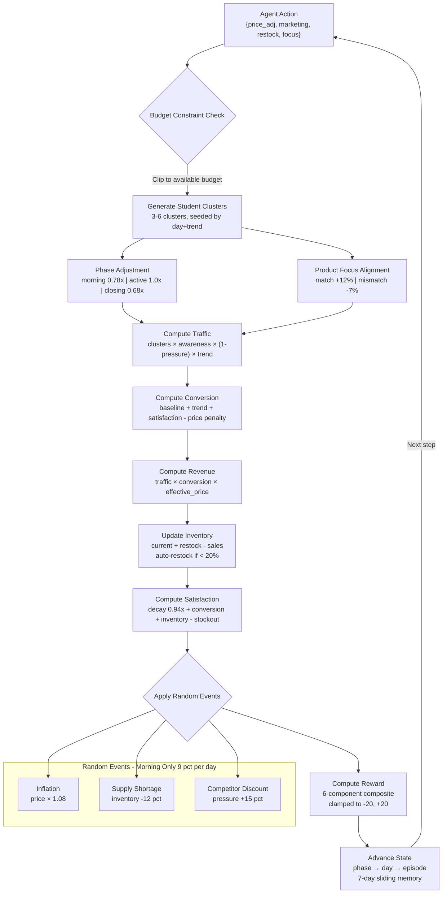
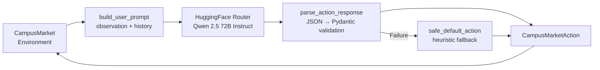

# CampusMarket RL — Gymnasium-Compatible Campus Shop Simulation

[]()
[]()
[]()
[]()
[]()
[]()
[]()

> One shop. Four product lines. Ninety days of campus chaos. Student clusters, competitor pressure, random events, and a reward function that punishes every shortcut.

## ⚡ TL;DR for Judges

- **OpenEnv Compliant** ✅
- **Gymnasium Compatible** ✅
- **Deterministic Evaluation** ✅
- **Rich Economic Simulation** ✅ (student clusters, competitors, seasonal trends, random events)
- **Reproducible Baseline Included** ✅
- **Three Graded Benchmark Tasks** ✅ (Easy / Medium / Hard with weighted scoring)

---

## What Is This?

A Gymnasium-compatible RL environment that simulates running a multi-category shop on a university campus. The agent controls **pricing, marketing, inventory, and product focus** across four shop categories — **Café, Food, Tech, and Stationery** — while navigating seasonal demand shifts, competitor pressure, random market events, and heterogeneous student behavior across a **90-day episode** (270 steps).

The environment models a rich economic simulation: **3–6 student clusters** with distinct budgets and price sensitivities arrive in waves shaped by academic quarters (exams, festivals, holidays). **Four competitor shops** exert dynamic pricing pressure. **Random events** — inflation spikes, supply shortages, competitor discounts — fire stochastically each morning. The agent must balance short-term profit against long-term customer satisfaction, inventory health, and brand awareness.

An **LLM-powered inference pipeline** connects to Hugging Face's model router (default: **Qwen 2.5 72B Instruct**) for intelligent action selection, with a built-in heuristic fallback. Three **graded benchmark tasks** (Easy 20%, Medium 30%, Hard 50%) with weighted scoring provide standardized evaluation.

Built for the **OpenEnv Hackathon 2026 — Meta PyTorch Team**.

---

## Table of Contents

* [Quick Start](#quick-start)
* [Architecture](#architecture)
* [Action & Observation Spaces](#action--observation-spaces)
* [Reward Function](#reward-function)
* [Seasonal Dynamics & Trends](#seasonal-dynamics--trends)
* [Student Demand Model](#student-demand-model)
* [Competitor Model](#competitor-model)
* [Random Events](#random-events)
* [Benchmark Tasks](#benchmark-tasks)
* [OpenEnv Compliance](#openenv-compliance)
* [Determinism Guarantee](#determinism-guarantee)
* [Baseline Performance](#baseline-performance)
* [Sample Output](#sample-output)
* [Explainability & Transparency](#explainability--transparency)
* [LLM Inference Pipeline](#llm-inference-pipeline)
* [Deployment](#deployment)
* [API Reference](#api-reference)
* [Project Structure](#project-structure)
* [Configuration](#configuration)
* [Key Design Decisions](#key-design-decisions)
* [Research Inspirations](#research-inspirations)
* [Contributing](#contributing)
* [License](#license)

---

## Quick Start

### Prerequisites

* Python 3.10+
* `pip` or `uv` (recommended)
* Docker (for HuggingFace Spaces deployment)

### Installation

```bash
# Clone
git clone https://github.com/Mrigank923/campusMarketRL.git
cd campusMarketRL

# Create & activate virtual environment
python -m venv .venv
source .venv/bin/activate        # Linux / Mac
.venv\Scripts\activate           # Windows

# Install dependencies
pip install -r requirements.txt
pip install -e .
```

### Run the Validator & Baseline Benchmark

```bash
# Validate OpenEnv compliance
openenv validate

# Run deterministic graded benchmark across all 3 tasks
python tasks/grader.py

# Run LLM-powered inference
python inference.py
```

### Start the Environment Server

```bash
# Exposes /health, /reset, /step, /state, /schema, /ws endpoints
python main.py
```

Open `http://localhost:7860/docs` for the interactive API explorer.

---

## Architecture

We use a layered simulation architecture with deterministic seeded generation at every level.



### Step Computation Flow (Per Turn)

```
Agent Action
{ price_adjustment, marketing_spend, restock_amount, product_focus }
      │
      ▼
Budget Constraint Check (clip spend to available budget)
      │
      ▼
Generate Student Clusters (deterministic, seed + day + trend)
      │
      ├──► Align with Product Focus (preference match → +12% visit probability)
      └──► Adjust for Day Phase (morning 0.78x, active 1.0x, closing 0.68x)
             │
             ▼
Generate Competitors (4 shops, seeded, pricing/marketing/inventory)
      │
      ▼
Compute Metrics Pipeline
      │
      ├── Awareness     (decay 0.93x + marketing lift + revenue signal + seasonal)
      ├── Traffic        (cluster_visits × awareness × (1 - pressure) × trend)
      ├── Conversion     (baseline + trend + satisfaction - price penalty)
      ├── Revenue        (traffic × conversion × effective_price)
      ├── Inventory      (current + restock - sales, auto-restock if < 20%)
      ├── Satisfaction   (decay 0.94x + conversion lift + inventory signal - stockout)
      └── Sentiment      (trend + satisfaction - competitor pressure)
             │
             ▼
Apply Random Events (morning phase only, ~9% probability per day)
      │
      ├── Inflation          → base price × 1.08
      ├── Supply Shortage    → inventory - 12%
      └── Competitor Discount → competitor pressure + 15%
             │
             ▼
Compute Reward (6-component composite, clamped to [-20, +20])
      │
      ▼
Advance State (phase → day → episode, 7-day sliding memory window)
```

---

## Action & Observation Spaces

### Action Space

The agent controls four continuous/discrete parameters each step:

| Parameter | Type | Range | Description |
|-|-|-|-|
| `price_adjustment` | `float` | `[-1.0, 1.0]` | Relative price change applied to base price ($100). +0.35 weight on effective price |
| `marketing_spend` | `float` | `[0, 2000]` | Budget spent on awareness campaigns. Diminishing returns above ~$630 |
| `restock_amount` | `int` | `[0, 200]` | Units to add to inventory (capacity: 400 units). Cost: $1.80/unit |
| `product_focus` | `enum` | `cafe \| food \| tech \| stationary` | Category focus — boosts visit probability for matching student clusters (+12%) |

Actions are **automatically clipped** to the available budget. Marketing spend is prioritized over restocking. If the agent overspends, the engine caps execution silently and logs the discrepancy in debug info.

### Observation Space

An 11-dimensional feature vector returned each step:

| Feature | Range | Description |
|-|-|-|
| `day` | `[1, 90]` | Current simulation day |
| `phase` | `morning \| active \| closing` | Current day phase (encoded as 0/1/2 in Gymnasium) |
| `shop_traffic` | `[0, 10000]` | Number of student visitors this step |
| `conversion_rate` | `[0.05, 0.80]` | Fraction of visitors who purchase |
| `revenue` | `[0, 50000]` | Revenue generated this step |
| `customer_satisfaction` | `[0, 1]` | Composite satisfaction score (decays 0.94x/step) |
| `inventory_level` | `[0, 1]` | Current stock as fraction of 400-unit capacity |
| `monthly_budget` | `[0, 10000]` | Remaining budget (resets every 30 days) |
| `awareness` | `[0.05, 1]` | Brand awareness (decays 0.93x/step) |
| `market_sentiment` | `[0, 1]` | Composite market health indicator |
| `competitor_pressure` | `[0, 1]` | Normalized competitive threat from 4 rival shops |

Additional metadata includes `trend_factor`, `reward`, `done` flag, and detailed debug info with per-component breakdowns.

---

## Reward Function

The reward signal is a **profit-first composite function** with six components, computed per-step and clamped to `[-20, +20]`:

```
R(step) = (gross_profit / 5000) × 8.0           # Profit signal (dominant)
         + satisfaction_delta × 6.0               # Improving customer happiness
         - inventory_balance_penalty              # Deviation from 45% target (±15% tolerance)
         - overstock_penalty                      # Inventory > 80% capacity × 8.0
         + inventory_progress_reward              # Improving toward target × 0.5
         - stockout_penalty                       # Ran out of stock: -8.0 (controllable only)
         - overpricing_penalty                    # Positive price_adjustment × 4.0
```

### Gross Profit Calculation

```
gross_profit = revenue - marketing_spend - manual_restock_cost - auto_restock_cost
```

### Reward Component Weights

| Component | Weight / Scale | Signal |
|-|-|-|
| Normalized profit | ×8.0 (÷5000) | Primary driver — maximizing net revenue |
| Satisfaction delta | ×6.0 | Reward improvement, penalize decline |
| Inventory balance | ×4.0 | Deviation from optimal 45% level |
| Overstock penalty | ×8.0 | Penalizes inventory > 80% |
| Stockout penalty | -8.0 (flat) | Harsh penalty for lost sales (controllable only) |
| Overpricing penalty | ×4.0 | Discourages aggressive price hikes |

### Design Philosophy

The reward creates deliberate **tension across all four action levers**: marketing spend increases awareness but cuts into profit. Restocking prevents stockouts but costs money. Price increases boost per-unit revenue but tank conversion rates and satisfaction. The agent must find a sustainable equilibrium — no single lever can be maxed without consequences on the others.

Supply shortage-triggered stockouts **do not incur the -8.0 penalty** — the reward function distinguishes controllable from exogenous stockouts.

---

## Seasonal Dynamics & Trends

The academic calendar is modeled through **4 quarters** (23 days each) with distinct trend distributions:

| Quarter | Normal | Festival | Exam | Holiday | Character |
|-|-|-|-|-|-|
| **Q1** (Days 1–23) | 68% | 22% | 10% | — | Opening semester, occasional celebrations |
| **Q2** (Days 24–46) | 35% | 15% | 50% | — | Midterm crunch — demand drops sharply |
| **Q3** (Days 47–69) | 78% | — | 10% | 12% | Steady state with holiday breaks |
| **Q4** (Days 70–90) | 33% | 52% | — | 15% | End-of-year festivals, high spending |

### Trend Multipliers on Demand

| Trend | Traffic Multiplier | Effect |
|-|-|-|
| **Normal** | 1.00x | Baseline campus activity |
| **Festival** | 1.30x | +30% traffic, +18% student budgets, +12% visit probability |
| **Exam** | 0.70x | -30% traffic, -5% budgets, -12% visit probability, -10% cluster sizes |
| **Holiday** | 0.50x | -50% traffic, fewer clusters (max 4), -8% visit probability |

---

## Student Demand Model

Each step generates **3–6 student clusters** (deterministic, seeded) representing distinct campus demographics:

| Band | Cluster Size | Budget Range | Price Sensitivity | Visit Probability |
|-|-|-|-|-|
| **Budget-conscious** | 18–45 students | $70–$120 | 0.65–0.95 (high) | 0.38–0.60 |
| **Mid-range** | 30–70 students | $121–$220 | 0.35–0.70 (medium) | 0.30–0.55 |
| **Premium** | 20–55 students | $221–$360 | 0.10–0.45 (low) | 0.22–0.48 |

### Cluster Behavior Modifiers

- **Product focus alignment**: If the agent's `product_focus` matches a cluster's preference → **+12% visit probability**; mismatch → **-7%**
- **Phase adjustment**: Morning 0.78x, active 1.0x, closing 0.68x visit probability
- **Trend adjustment**: Festival +12%, exam -12%, holiday -8% baseline visit probability
- **Weighted price sensitivity**: Aggregated across all clusters for conversion rate calculation

---

## Competitor Model

**Four rival shops** are generated deterministically each step, creating dynamic competitive pressure:

| Parameter | Range | Description |
|-|-|-|
| `shop_type` | `cafe \| food \| tech \| stationary` | First competitor always matches agent's focus |
| `pricing_factor` | `[0.8, 1.2]` | Relative to base price (lower = more aggressive) |
| `marketing_power` | `[0.2, 1.0]` | Competitor marketing effectiveness |
| `inventory_level` | `[0.45, 1.0]` | Competitor stock availability |

### Pressure Score Calculation

```
competitor_pressure = Σ (0.45 × same_type + 0.25 × pricing + 0.20 × marketing + 0.10 × inventory) / N
```

Same-type competitors exert **full weight (1.0)**, cross-category competitors only **0.45** — the agent's `product_focus` choice directly controls how much competitive pressure it faces.

---

## Random Events

Stochastic market events fire during **morning phases only** (~9% combined probability per day):

| Event | Probability | Impact | Duration |
|-|-|-|-|
| **Inflation** | 3% | Base price × 1.08 (costs rise, revenue may rise) | 1 phase |
| **Supply Shortage** | 3% | Inventory -12% (may trigger stockout) | 1 phase |
| **Competitor Discount** | 3% | Competitor pressure +15% (harder to convert) | 1 phase |

---

## Benchmark Tasks

Three difficulty tiers with **weighted overall scoring** (Easy 20%, Medium 30%, Hard 50%):

| # | Task | Difficulty | Horizon | Key Tension |
|-|-|-|-|-|
| 1 | **Steady State** | 🟢 Easy | 30 days (seed=42) | Basic retail control — revenue vs. satisfaction |
| 2 | **Adaptive Pricing** | 🟡 Medium | 60 days (seed=137) | Seasonal transitions, product rotation, adaptive pricing |
| 3 | **Full Horizon** | 🔴 Hard | 90 days (seed=7) | Full academic year — budget, awareness, and long-term survival |

### 🟢 Easy — Steady State (30 days, seed=42)

Run a conservative shop for 30 days with a simple heuristic.

| Criterion | Target | Direction |
|-|-|-|
| Cumulative Revenue | ≥ $150,000 | Higher is better |
| Avg Satisfaction | ≥ 0.40 | Higher is better |
| Stockout Fraction | ≤ 25% | Lower is better |

### 🟡 Medium — Adaptive Pricing (60 days, seed=137)

Navigate seasonal transitions with adaptive pricing and product rotation.

| Criterion | Target | Direction |
|-|-|-|
| Cumulative Revenue | ≥ $400,000 | Higher is better |
| Avg Satisfaction | ≥ 0.48 | Higher is better |
| Stockout Fraction | ≤ 15% | Lower is better |
| Avg Reward / Step | ≥ 3.0 | Higher is better |

### 🔴 Hard — Full Horizon (90 days, seed=7)

Survive the entire academic year while maintaining financial health and awareness.

| Criterion | Target | Direction |
|-|-|-|
| Cumulative Revenue | ≥ $900,000 | Higher is better |
| Avg Satisfaction | ≥ 0.55 | Higher is better |
| Stockout Fraction | ≤ 8% | Lower is better |
| Avg Reward / Step | ≥ 5.0 | Higher is better |
| Final Budget | ≥ $500 | Higher is better |
| Final Awareness | ≥ 0.50 | Higher is better |

### Scoring Formula

Each criterion is scored 0.0–1.0:
- **"At least" criteria**: `score = clamp(actual / target, 0, 1)`
- **"At most" criteria**: `score = clamp(1 - actual / limit, 0, 1)`
- **Task grade**: Average of criterion scores
- **Overall grade**: Weighted average (Easy 20%, Medium 30%, Hard 50%)

### Curriculum Learning Design

Tasks are ordered by increasing horizon length, metric complexity, and resource management pressure. Agents trained on Easy develop baseline pricing heuristics that transfer as warm starts into Medium and Hard, enabling a meaningful curriculum.

---

## OpenEnv Compliance

| Criterion | Status | Implementation |
|-|-|-|
| **API Compliance** | ✅ PASS | `reset(seed)`, `step(action)`, `state()` follow the OpenEnv spec exactly |
| **Grader Logic** | ✅ PASS | Deterministic grading clamped `[0.0, 1.0]`; weighted across 3 difficulty tiers |
| **YAML Spec** | ✅ PASS | `openenv.yaml` fully bounds state space, action space, and client config |
| **Determinism** | ✅ PASS | Strict seed propagation; zero global stochastic leakage |
| **Deployment** | ✅ PASS | Dockerized FastAPI on HuggingFace Spaces; verified via `/reset` + `/step` |
| **Gymnasium Wrapper** | ✅ PASS | `CampusMarketGymEnv` exposes standard Box/Dict spaces with numpy vectors |

---

## Determinism Guarantee

Rigorous RL benchmarking requires absolute reproducibility. CampusMarket RL guarantees it through three mechanisms:

**Strict Seed Propagation**: All randomness flows exclusively through an explicitly injected `random.Random(seed)` instance. Student clusters, competitor generation, trend selection, and random events all derive sub-seeds via `derive_seed(base_seed, offset)` — a deterministic hash. No calls to global `random` are made outside the seeded context.

**No Evaluation Noise**: The identical seed always produces the identical initial state, daily student clusters, competitor configurations, trend schedules, and event rolls. External validators receive the exact same MDP across all runs.

**Verifiable Transitions**: All simulation constants (85 parameters) are fixed in `config.py`. Budget constraints, auto-restock thresholds, and reward clamping are mathematical constants — no learned or stochastic gates.

```python
# Reproducible episode initialization
env = CampusMarketEnv(seed=42)
obs = env.reset(seed=42)
# → always identical initial state vector
```

---

## Baseline Performance

A pre-validated deterministic baseline ships with the environment. It confirms full traversability across all three tasks with no dead-ends or terminal crashes.

| Task | Baseline Grade | Revenue | Avg Satisfaction | Stockout | Notes |
|-|-|-|-|-|-|
| 🟢 Easy (30 days) | ~0.711 | $90,529 | 0.211 | 0.00% | Zero stockouts, revenue below target |
| 🟡 Medium (60 days) | ~0.801 | $170,003 | 0.374 | 0.00% | Strong avg reward (11.92/step) |
| 🔴 Hard (90 days) | ~0.709 | $282,374 | 0.518 | 0.00% | Perfect awareness (1.0), budget exhaustion |

**Reference Overall Grade: `~0.737`** (weighted: Easy 20% · Medium 30% · Hard 50%)

External LLMs benchmarking against CampusMarket RL must push their overall grade above **0.80** to demonstrate superior economic reasoning over the deterministic heuristic baseline.

---

## Sample Output

Executing `python tasks/grader.py` produces this evaluation trace:

```
Running all the tasks

EASY task done (0.02s)
MEDIUM task done (0.04s)
HARD task done (0.05s)

════════════════════════════════════════════════════════════════════════
  CAMPUS MARKET ENVIRONMENT — GRADING REPORT
════════════════════════════════════════════════════════════════════════

  Task: easy_steady_state  [EASY]
  Time: 0.02s
────────────────────────────────────────────────────────────────────────
  Criterion                       Actual       Target       Dir    Score
────────────────────────────────────────────────────────────────────────
  cumulative_revenue          90529.3800  150000.0000         ≥   0.6035
  avg_satisfaction                0.2114       0.4000         ≥   0.5286
  stockout_fraction               0.0000       0.2500         ≤   1.0000
────────────────────────────────────────────────────────────────────────
  Task Grade: 0.7107

  Task: medium_adaptive_pricing  [MEDIUM]
  Time: 0.04s
────────────────────────────────────────────────────────────────────────
  Criterion                       Actual       Target       Dir    Score
────────────────────────────────────────────────────────────────────────
  cumulative_revenue         170002.7700  400000.0000         ≥   0.4250
  avg_satisfaction                0.3741       0.4800         ≥   0.7793
  stockout_fraction               0.0000       0.1500         ≤   1.0000
  avg_reward                     11.9166       3.0000         ≥   1.0000
────────────────────────────────────────────────────────────────────────
  Task Grade: 0.8011

  Task: hard_full_horizon  [HARD]
  Time: 0.05s
────────────────────────────────────────────────────────────────────────
  Criterion                       Actual       Target       Dir    Score
────────────────────────────────────────────────────────────────────────
  cumulative_revenue         282373.7700  900000.0000         ≥   0.3137
  avg_satisfaction                0.5178       0.5500         ≥   0.9414
  stockout_fraction               0.0000       0.0800         ≤   1.0000
  avg_reward                     14.1694       5.0000         ≥   1.0000
  final_budget                    0.0000     500.0000         ≥   0.0000
  final_awareness                 1.0000       0.5000         ≥   1.0000
────────────────────────────────────────────────────────────────────────
  Task Grade: 0.7092

════════════════════════════════════════════════════════════════════════
  OVERALL GRADE: 0.7371  (range 0.0 – 1.0)
════════════════════════════════════════════════════════════════════════

  Weights: easy 20% · medium 30% · hard 50%
```

---

## Explainability & Transparency

Every `/step` API response exposes the full internal state of the simulation engine:

| Field | Description |
|-|-|
| `observation` | Full 11-feature vector (day, phase, traffic, conversion, revenue, satisfaction, inventory, budget, awareness, sentiment, pressure) |
| `reward` | Final clamped reward value for this step |
| `done` | Whether the episode has terminated |
| `info.trend` | Active seasonal trend (`normal`, `festival`, `exam`, `holiday`) |
| `info.quarter` | Current academic quarter (1–4) |
| `info.event` | Random event that fired this step (`none`, `inflation`, `supply_shortage`, `competitor_discount`) |
| `info.stockout_flag` | Whether a stockout occurred |
| `info.cluster_count` | Number of student clusters generated this step |
| `info.price_sensitivity` | Weighted price sensitivity across all clusters |
| `info.sales` | Actual units sold |
| `info.budget_start` | Budget at the start of this step |
| `info.executed_marketing_spend` | Actual marketing spend after budget constraint |
| `info.executed_restock_amount` | Actual restock after budget constraint |
| `info.budget_limited_action` | Boolean — was the action clipped by budget? |
| `info.gross_profit` | Revenue minus all costs |
| `info.inventory_balance_penalty` | Deviation penalty from 45% target |
| `info.overstock_penalty` | Penalty for inventory above 80% |
| `info.inventory_progress_reward` | Reward for moving toward optimal inventory |
| `info.base_reward` | Reward before smoothing |

```json
{
  "observation": {
    "day": 5,
    "phase": "active",
    "shop_traffic": 42,
    "conversion_rate": 0.3812,
    "revenue": 1601.04,
    "customer_satisfaction": 0.5423,
    "inventory_level": 0.6850,
    "monthly_budget": 8240.50,
    "awareness": 0.4912,
    "market_sentiment": 0.5100,
    "competitor_pressure": 0.4523,
    "trend_factor": 1.0
  },
  "reward": 2.1540,
  "done": false,
  "info": {
    "episode_id": "a1b2c3",
    "executed_day": 5,
    "executed_phase": "active",
    "trend": "normal",
    "quarter": 1,
    "cluster_count": 4,
    "price_sensitivity": 0.5812,
    "sales": 16,
    "stockout_flag": false,
    "event": "none",
    "event_price_multiplier": 1.0,
    "event_inventory_delta": 0.0,
    "budget_start": 8540.50,
    "executed_marketing_spend": 200.0,
    "executed_restock_amount": 10,
    "budget_limited_action": false,
    "gross_profit": 1383.04,
    "effective_base_price": 103.50,
    "inventory_balance_penalty": 0.0,
    "overstock_penalty": 0.0,
    "inventory_progress_reward": 0.12,
    "base_reward": 2.1540
  }
}
```

---

## LLM Inference Pipeline

The inference script (`inference.py`) connects to any **OpenAI-compatible API** for LLM-powered action selection:



### How It Works

1. **Observe**: Environment returns structured observation (day, phase, KPIs, trend factor)
2. **Build Prompt**: System prompt defines the JSON schema; user prompt includes current observation + last 5 step summaries
3. **Query LLM**: Send to Hugging Face router (or any OpenAI-compatible endpoint) at temperature 0.2
4. **Parse & Validate**: Extract JSON from response, validate via Pydantic with field constraints
5. **Fallback**: On any failure (network, parsing, validation), use a rule-based heuristic that reads the observation directly
6. **Score**: Cumulative reward normalized by theoretical maximum → `[0, 1]` success score

### Fallback Heuristic Strategy

The `safe_default_action()` implements a multi-signal decision tree:

- **Inventory < 25%** → Aggressive restock (60 units)
- **Satisfaction < 45%** → Price cut (-15%)
- **Trend > 1.1 + satisfaction > 55%** → Price increase (+10%)
- **Competitor pressure > 60%** → Defensive pricing (-8%)
- **Awareness < 45%** → Higher marketing spend (8% of budget)
- **Trend > 1.1** → Focus tech; **< 0.8** → Focus food; **morning** → Focus café

---

## Deployment

CampusMarket RL is fully containerized and verified for external evaluation on **HuggingFace Spaces**.

```dockerfile
FROM python:3.11-slim
WORKDIR /app
COPY requirements.txt pyproject.toml README.md __init__.py client.py config.py enums.py gym_env.py models.py openenv.yaml ./
COPY server ./server
RUN pip install --no-cache-dir -r requirements.txt
COPY docs ./docs
COPY static ./static
COPY tasks ./tasks
COPY inference.py main.py test_env.py ./
RUN pip install --no-cache-dir --no-deps .
EXPOSE 7860
CMD ["python", "main.py"]
```

The Spaces deployment natively responds to standard OpenEnv `/reset`, `/step`, `/state` and `/ws` endpoints. No authentication required for evaluation. The `main.py` entrypoint respects the `PORT` environment variable (defaults to 7860).

---

## API Reference

### REST Endpoints (port 7860)

| Method | Endpoint | Description |
|-|-|-|
| `GET` | `/health` | Server health check |
| `GET` | `/state` | Full environment state snapshot — episode, day, phase, step count, 7-day memory |
| `GET` | `/schema` | Action/observation schema introspection |
| `GET` | `/docs` | Interactive OpenAPI documentation (Swagger UI) |
| `POST` | `/reset` | Start a new episode with `{ "seed": 42 }` |
| `POST` | `/step` | Execute one agent action, returns observation + reward + done |

### WebSocket

| Endpoint | Description |
|-|-|
| `WS /ws` | Persistent OpenEnv session — reset/step via WebSocket messages |

### Reset Payload

```json
{
  "seed": 42
}
```

### Step Payload

```json
{
  "action": {
    "price_adjustment": 0.1,
    "marketing_spend": 100.0,
    "restock_amount": 10,
    "product_focus": "food"
  }
}
```

Valid `product_focus` values: `cafe`, `food`, `tech`, `stationary`.

---

## Project Structure

```
campusMarketRL/
│
├── server/
│   ├── app.py                  # FastAPI app via OpenEnv create_app()
│   ├── environment.py          # CampusMarketEnv (reset/step/state)
│   ├── engine.py               # Pure simulation engine (744 lines)
│   ├── state_manager.py        # State transitions (phase/day/episode/memory)
│   ├── student_model.py        # Student cluster generation (3-6 clusters)
│   ├── competitor_model.py     # Competitor pressure computation (4 shops)
│   ├── trend_model.py          # Seasonal trend & quarter modeling
│   ├── Dockerfile              # Server-specific container config
│   └── requirements.txt        # Server-specific dependencies
│
├── tasks/
│   ├── grader.py               # Weighted grading system (Easy/Medium/Hard)
│   ├── task_easy.py            # 30-day steady-state task (seed=42)
│   ├── task_medium.py          # 60-day adaptive pricing (seed=137)
│   ├── task_hard.py            # 90-day full horizon (seed=7)
│   └── grading_report.txt      # Latest grading results
│
├── docs/
│   ├── GETTING_STARTED.md      # Quick setup guide
│   ├── IMPLEMENTATION_STATUS.md# Architecture overview
│   └── QUICK_REFERENCE.md      # Endpoint & command cheatsheet
│
├── static/
│   └── index.html              # Landing page served at /
│
├── __init__.py                  # Package exports
├── models.py                    # Pydantic models (Action, Observation, State)
├── config.py                    # All simulation constants (85 parameters)
├── enums.py                     # PhaseEnum, ShopTypeEnum, TrendTypeEnum
├── client.py                    # OpenEnv WebSocket client
├── gym_env.py                   # Gymnasium wrapper (Box/Dict spaces)
├── inference.py                 # LLM-powered inference pipeline
├── main.py                      # Entry point (uvicorn server)
├── test_env.py                  # Local smoke test
│
├── Dockerfile                   # Production container (Python 3.11-slim)
├── openenv.yaml                 # OpenEnv environment descriptor
├── pyproject.toml               # Project metadata & dependencies
├── requirements.txt             # Python dependencies
├── validate-submission.sh       # OpenEnv submission validator (3-step)
└── .env.example                 # Environment variable template
```

---

## Configuration

### Environment Variables

```bash
# LLM Provider (required for inference.py)
HF_TOKEN=your_huggingface_token              # Hugging Face API token
API_BASE_URL=https://router.huggingface.co/v1  # Model router endpoint
MODEL_NAME=Qwen/Qwen2.5-72B-Instruct         # Default model

# Environment Server
CAMPUS_MARKET_ENV_BASE_URL=http://localhost:7860  # Server URL for remote inference

# Docker (optional — uses Docker image instead of HTTP)
LOCAL_IMAGE_NAME=campus-market:latest             # Docker image for from_docker_image()
```

All variables have safe defaults; the environment runs fully deterministically without any API keys (inference falls back to the built-in heuristic).

### Simulation Constants

Key parameters in `config.py`:

| Parameter | Default | Description |
|-|-|-|
| `MAX_DAYS_PER_EPISODE` | 90 | Days per episode |
| `PHASES_PER_DAY` | 3 | Phases per day (morning/active/closing) |
| `DEFAULT_BUDGET` | $10,000 | Monthly budget (resets every 30 days) |
| `INVENTORY_CAPACITY_UNITS` | 400 | Maximum inventory capacity |
| `INVENTORY_THRESHOLD` | 20% | Below this triggers auto-restock |
| `AUTO_RESTOCK_TARGET_LEVEL` | 45% | Auto-restock fills to this level |
| `AUTO_RESTOCK_UNIT_COST` | $1.80 | Cost per restocked unit |
| `BASE_PRICE` | $100 | Base product price |
| `MEMORY_WINDOW_DAYS` | 7 | Sliding window for revenue/satisfaction memory |
| `QUARTER_LENGTH_DAYS` | 23 | Academic quarter length |
| `COMPETITOR_COUNT` | 4 | Number of rival shops |
| `REWARD_CLAMP_MIN / MAX` | -20 / +20 | Reward bounds |
| `EVENT_INFLATION_PROBABILITY` | 3% | Inflation event chance per morning |
| `EVENT_SUPPLY_SHORTAGE_PROBABILITY` | 3% | Supply shortage chance per morning |
| `EVENT_COMPETITOR_DISCOUNT_PROBABILITY` | 3% | Competitor discount chance per morning |

---

## Key Design Decisions

| Decision | Rationale |
|-|-|
| **Deterministic seeded simulation** | Given the same seed, the environment produces identical trajectories — critical for reproducible benchmarking and fair grading |
| **3-phase day structure** | Morning/active/closing phases create intra-day dynamics that reward phase-aware strategies (e.g., café focus in mornings) |
| **Auto-restock safety net** | When inventory drops below 20%, automatic restocking prevents catastrophic stockout spirals, but costs deduct from budget |
| **Budget-constrained actions** | Actions are silently clipped to available budget rather than rejected — the agent always acts, but may not get what it asked for |
| **Composite reward with profit dominance** | Profit term has 8.0 weight versus 4.0–6.0 for penalties — ensures the primary signal is "make money" while health metrics shape the gradient |
| **Exogenous vs. controllable stockouts** | Supply-shortage-triggered stockouts skip the -8.0 penalty — agents shouldn't be punished for acts of nature |
| **Product focus as category selector** | Rather than separate inventory per category, focus controls which student clusters are attracted — simpler action space, richer demand dynamics |
| **7-day sliding memory** | Revenue and satisfaction memory smooths state transitions and enables awareness/sentiment calculations that depend on recent history |
| **Weighted benchmark grading** | Hard task at 50% weight ensures the overall grade reflects sustained long-horizon performance, not just short-term heuristics |
| **Pydantic v2 throughout** | Every model uses `ConfigDict(extra="forbid")` — strict validation catches schema mismatches at the boundary, not deep in simulation logic |
| **OpenEnv + Gymnasium dual interface** | OpenEnv for deployment/evaluation, Gymnasium for RL training — the same core engine serves both without abstraction leaks |

---

## Research Inspirations

* **[OpenEnv](https://github.com/meta-pytorch/OpenEnv)** — Meta's Gymnasium-compatible environment framework and evaluation protocol
* **Multi-Agent Market Simulations** — Economic simulation environments with heterogeneous agent populations and competitive dynamics
* **Seasonal demand modeling** — Academic calendar-driven demand curves with quarter-based trend distributions
* **Composite reward shaping** — Multi-objective reward functions that balance profit, satisfaction, and operational health
* **Deterministic RL evaluation** — Reproducible benchmarking through strict seed propagation and fixed transition dynamics

---

## Contributing

```bash
# Fork and clone
git checkout -b feature/my-feature

# Run the test suite
python test_env.py
python tasks/grader.py

# Validate OpenEnv compliance before submitting
openenv validate
```

**Areas we'd love help with:**

* New student cluster archetypes (graduate students, faculty, visitors)
* Additional random events (campus construction, food truck arrival, sports events)
* Multi-shop agent support (controlling multiple locations simultaneously)
* PPO / SAC / DQN training scripts with the Gymnasium wrapper
* Frontend dashboard with real-time KPI visualization
* Alternative reward shaping strategies and ablation studies
* Integration with additional LLM providers for inference

---

## License

BSD-3-Clause. See `LICENSE` for details.

---

*Built for the OpenEnv Hackathon 2026 — Meta PyTorch Team*

*An environment where pricing, inventory, marketing, and demand don't exist in isolation — they collide in the exact rhythms of campus life that make running a real shop hard.*
